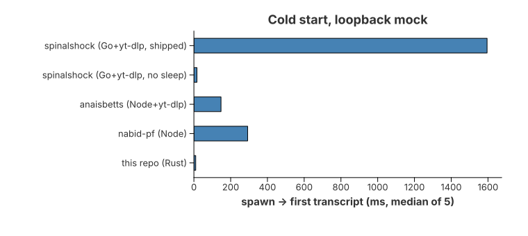
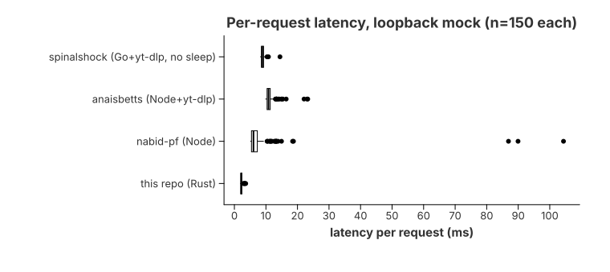
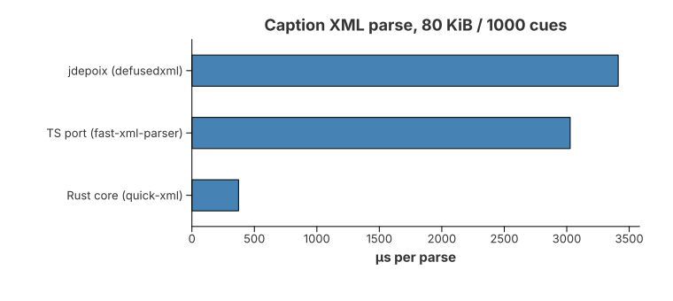

# Benchmarks

Every number here comes from `bench/results/*.json`, which also records the
machine, commit, toolchains and competitor versions. Charts are rendered from
the same JSON.

**Setup for the published run:** Intel Xeon @ 2.10 GHz, 4 cores, Linux x86_64,
commit `33a66f9`, rustc 1.94.1, Node 22.22, Python 3.11, Go 1.24.
Competitors: `@anaisbetts/mcp-youtube` 0.8.0, `youtube-video-summarizer-mcp`
(nabid-pf) 1.8.9, spinalshock `20ebd3f`, `youtube-transcript-api` (jdepoix) 1.2.4.

## Results

### Simulated production network (80 ms per HTTP response)


| MCP server | Fetch path | p50 | p95 | Cold start | Peak RSS |
|---|---|---:|---:|---:|---:|
| **this repo (Rust)** | Innertube, 2 requests | **163.9 ms** | **164.4 ms** | **171 ms** | **7.7 MiB** |
| nabid-pf (Node) | Innertube, 2 requests | 168.8 ms | 173.5 ms | 430 ms | 114.2 MiB |
| spinalshock (Go + yt-dlp), rate-limit removed | yt-dlp subprocess | 503.2 ms | 506.1 ms | 511 ms | 13.8 MiB |
| anaisbetts (Node + yt-dlp) | yt-dlp subprocess | 506.4 ms | 512.1 ms | 638 ms | 81.3 MiB |
| spinalshock (Go + yt-dlp), as shipped | yt-dlp + 1.5–3 s sleep | 2411 ms | 2930 ms | 2863 ms | 12.6 MiB |

n = 150 calls per server (3 fresh processes × 50), 5 calls for the as-shipped
spinalshock. Full percentiles: [`bench/results/mock.md`](bench/results/mock.md).

What this shows:

- **About 3× faster than yt-dlp-based servers** (164 ms vs 503–506 ms). yt-dlp
  pays about 240 ms of Python start-up plus extra round-trips on every call.
- **About the same speed as the other direct-Innertube server (nabid-pf).**
  Both make two HTTP requests, so the network dominates. The difference is
  memory (7.7 vs 114 MiB) and cold start (171 vs 430 ms).
- **Lowest memory of any server tested:** 7.7 MiB, against 14 MiB for the Go
  servers and 81–114 MiB for the Node ones.

### Loopback (no added network delay, CPU-bound)





| MCP server | p50 | p99 | Cold start | Peak RSS |
|---|---:|---:|---:|---:|
| **this repo (Rust)** | **2.15 ms** | **3.30 ms** | **9.9 ms** | **7.8 MiB** |
| nabid-pf (Node) | 6.05 ms | 88.45 ms | 292 ms | 114.6 MiB |
| spinalshock, rate-limit removed | 8.84 ms | 10.58 ms | 16.6 ms | 14.0 MiB |
| anaisbetts | 10.81 ms | 22.59 ms | 147 ms | 81.3 MiB |

On loopback the yt-dlp servers call a stub that returns instantly, so this
table measures each server's own overhead. It is the best case for them.

### Parser and library level



| | Rust core | TS port | jdepoix (Python) |
|---|---:|---:|---:|
| Caption XML parse, 80 KiB | **373 µs** (207 MiB/s) | 3028 µs | 3412 µs |
| Innertube JSON parse | **0.82 µs** | 3.02 µs | 4.80 µs |
| Fetch p50 on loopback | **1.51 ms** | 5.79 ms | 6.46 ms |
| Peak RSS after 100 fetches | **5.4 MiB** | 113.4 MiB | 29.6 MiB |

The TS port was written for this benchmark (same algorithm, `fast-xml-parser`).
It is not a published server. Parsing takes under 0.4 ms against a network
round-trip of 100+ ms, so it is not what users feel. What users feel is cold
start and memory.

### Context size of the output

All servers return about 41–44 KB of text for the same 80 KiB caption track,
so for plain text **there is no context-size advantage** over the others. The
`format` option is what changes context use:

| `format` | Bytes (same fixture) |
|---|---:|
| `text` | 41,444 |
| `vtt` | 72,453 |
| `srt` | 76,338 |
| `markdown` (per-cue timestamp links) | 103,468 |
| `json` (per-cue timestamp links) | 180,053 |

## Method

- **Mock YouTube.** `bench/mock/server.py` serves a canned Innertube response
  and an 80 KiB, 1000-cue caption track (roughly a 30-minute talk). The
  PROD-sim profile adds 80 ms to every response.
- **yt-dlp servers** get a `yt-dlp` stub on `PATH`. On loopback it returns
  instantly. Under PROD-sim it sleeps 240 ms (measured yt-dlp start-up) plus
  3 × 80 ms (its internal round-trips). Real yt-dlp against real YouTube is
  slower: a single live call from this machine took about 3.3 s.
- **Same client for every server.** `bench/mcp-client/drive.js` spawns the
  server, runs the MCP `initialize` handshake, and times each `tools/call`
  from the client side. A call counts as successful only if it returns
  non-empty text without `isError`. All published rows are 100% successful.
- **Cold start** = spawn → handshake → first transcript, median of 5 fresh
  processes. **Peak RSS** = the server's `VmHWM` after the run.
- **This repo** is the release binary (`--stdio`, rmcp), pointed at the mock
  with `YTMCP_INNERTUBE_URL`.

## Not measured, not claimed

- **Real YouTube latency.** The published numbers are mock-based. `run.py live`
  exists, but from cloud IPs YouTube bot-checks most requests (LOGIN_REQUIRED /
  HTTP 429) for every tool, jdepoix included, so a live run from a datacenter
  mostly measures blocking. Run it from a residential connection.
- **Model TTFT or token throughput.** Faster retrieval shortens the wait before
  the model starts generating. It does not change the model's own
  time-to-first-token or tokens per second, and nothing here measures those.
- **arXiv search.** It isn't in this repo and has no end-to-end measurement
  (same query and papers, request → usable text, against a named baseline).
  There are no arXiv numbers.
- **kimtaeyoon83** and other multi-platform servers were not benchmarked.

## Changes from the previous version of this page

- The old "this repo" row was a separate bench client with a hand-written MCP
  loop. It is now the shipped binary.
- The old anaisbetts rows measured a silent failure: a malformed fixture made
  its VTT parser return an empty transcript. That is fixed, and the harness
  now fails any empty or `isError` response.
- The old "~270× faster than yt-dlp servers" headline compared against
  spinalshock's deliberate 1.5–3 s sleep. The yt-dlp cost alone is about 3×.
- The binary is 4.9 MiB, not 3.3 MiB.
- The XML parser now builds timestamped segments for the output formats, so it
  runs at 207 MiB/s rather than the old 409 MiB/s. It is still about 8–9×
  faster than the Node and Python parsers.

## Reproduce

```bash
bench/setup.sh              # builds this repo, installs pinned competitors into bench/.work/
python3 bench/run.py all    # micro + mock: writes bench/results/*.json, *.md, chart-*.svg
python3 bench/run.py live   # optional: real YouTube, from an unblocked IP
```

Requirements: cargo, Node ≥ 18, Python ≥ 3.9, Go ≥ 1.21, git. The mock uses port 18080.
Details: [`bench/README.md`](bench/README.md).

For a Criterion regression check on the parser alone:
`cargo bench -p youtube-transcript-mcp-core --bench parser`.
