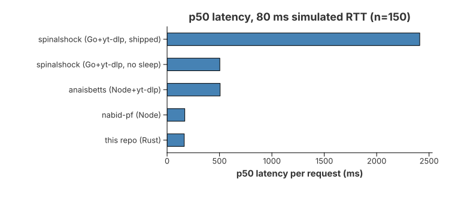
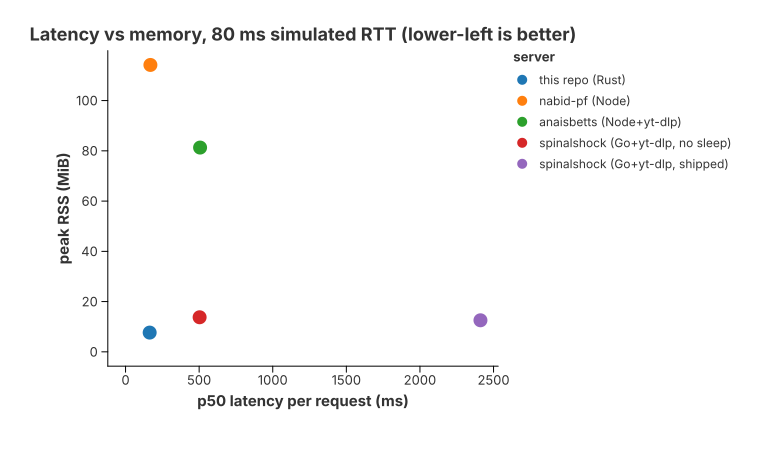

<div align="center">
  

  # YouTube Transcript MCP Server

  A Model Context Protocol (MCP) server that extracts transcripts from YouTube
  videos. Written in Rust. Runs as a native binary or as a Cloudflare Worker
  (via WebAssembly) — same logic, two deployment targets.
</div>


## Features

- **Single tool**: `get_transcript(url, language?, format?)` — works with any
  YouTube URL format.
- **Three ways to call it**:
  - **MCP** over stdio (native) or JSON-RPC over HTTP / SSE (native + Worker)
  - **Raw HTTP**: `GET /transcript?url=…&language=…` returns plain text — curl-friendly
  - **CLI one-shot**: `youtube-transcript-mcp --url <URL>` prints to stdout and exits
- **Native binary**: stdio transport for Claude Desktop / local clients, plus
  an HTTP server with `/transcript`, `/mcp`, and `/sse`.
- **WASM Worker**: same Rust code, deployed to Cloudflare Workers. Exposes the
  same `/transcript`, `/mcp`, `/sse` endpoints.
- **Whisper fallback** (native only): when a video has no captions and
  `WHISPER_URL` is set, the server downloads the audio stream and transcribes
  it via a [faster-whisper-server](https://github.com/fedirz/faster-whisper-server)
  compatible endpoint.
- **URL flexibility**: `watch?v=`, `youtu.be/`, `/shorts/`, `/live/`, `/embed/`,
  international domains (`youtube.co.uk`, `youtube.de`, …), with or without scheme.
- **Language selection**: BCP-47 codes (`en`, `es`, `fr`, …) or `auto` (default).
  Falls back to English with an explanatory note when the requested language
  is unavailable.
- **Output formats**: `text` (default), `json`, `srt`, `vtt`, or `markdown`.
  `json` and `markdown` embed a clickable deep link (`watch?v=…&t=<secs>s`) for
  every cue, so you can open the file and jump straight to that moment in the
  video; `srt`/`vtt` are standard subtitle files.

## Repository layout

```
crates/
  core/      # pure transcript logic (URL parsing, Innertube/XML decoding, language selection)
  native/    # rmcp-based binary (stdio + HTTP/SSE)
  worker/    # Cloudflare Worker (compiled to wasm32-unknown-unknown via worker-build)
```

`crates/core` is I/O-free and is consumed by both the native binary and the
Worker. The Worker crate declares its own `[workspace]` so wrangler can build
it for `wasm32-unknown-unknown` without affecting the host workspace.

## Benchmarks





| MCP server | p50, 80 ms simulated RTT | Cold start | Peak RSS |
|---|---:|---:|---:|
| **this repo (Rust)** | **164 ms** | **171 ms** | **7.7 MiB** |
| nabid-pf (Node, direct Innertube) | 169 ms | 430 ms | 114 MiB |
| spinalshock (Go + yt-dlp), rate-limit removed | 503 ms | 511 ms | 14 MiB |
| anaisbetts (Node + yt-dlp) | 506 ms | 638 ms | 81 MiB |
| spinalshock (Go + yt-dlp), as shipped | 2411 ms | 2863 ms | 13 MiB |

Measured against a local YouTube mock (80 KiB caption track, 80 ms added per
response), with the same MCP client for every server and competitors at pinned
versions. Results are about 3× faster than yt-dlp-based servers and on par
with nabid-pf on latency, with the lowest memory of any server tested. Setup,
loopback numbers, parser numbers, what isn't claimed, and how to reproduce:
[BENCHMARKS.md](BENCHMARKS.md).

## Self-hosting (native binary)

### From source

```bash
git clone https://github.com/twn-systems/youtube-transcript-mcp-rust
cd youtube-transcript-mcp-rust
cargo build --release -p youtube-transcript-mcp
# binary at target/release/youtube-transcript-mcp
```

### Run

```bash
# One-shot CLI — print transcript to stdout and exit
./target/release/youtube-transcript-mcp --url 'https://youtu.be/dQw4w9WgXcQ'
./target/release/youtube-transcript-mcp --url '…' --language es
# Markdown with clickable timestamp links (also: json, srt, vtt)
./target/release/youtube-transcript-mcp --url '…' --format markdown

# stdio MCP (Claude Desktop, local MCP clients)
./target/release/youtube-transcript-mcp --stdio

# HTTP server (raw API + MCP) — defaults to 127.0.0.1:3000
./target/release/youtube-transcript-mcp
./target/release/youtube-transcript-mcp --host 0.0.0.0 --port 8080
```

HTTP endpoints:

| Method | Path                                     | Purpose                                                   |
|--------|------------------------------------------|-----------------------------------------------------------|
| GET    | `/`                                      | Server info JSON                                          |
| GET    | `/transcript?url=…&language=…&format=…`  | Transcript in the requested `format` (defaults to `text`) |
| POST   | `/mcp`                                   | MCP JSON-RPC (Streamable HTTP)                            |
| GET    | `/sse`                                   | SSE handshake                                             |
| POST   | `/sse`                                   | MCP JSON-RPC over SSE (single-shot)                       |

```bash
curl 'http://127.0.0.1:3000/transcript?url=https://youtu.be/dQw4w9WgXcQ&language=en'
# Markdown with clickable timestamp links
curl 'http://127.0.0.1:3000/transcript?url=https://youtu.be/dQw4w9WgXcQ&format=markdown'
```

### Claude Desktop (stdio)

Add to `claude_desktop_config.json`:

```json
{
  "mcpServers": {
    "youtube-transcript": {
      "command": "/absolute/path/to/youtube-transcript-mcp",
      "args": ["--stdio"]
    }
  }
}
```

### Whisper fallback (optional)

When a video has no captions, the native server can fall back to ASR.
Point it at any OpenAI-compatible `/v1/audio/transcriptions` endpoint (for
example, [faster-whisper-server](https://github.com/fedirz/faster-whisper-server)):

```bash
WHISPER_URL=http://localhost:8000 ./target/release/youtube-transcript-mcp --stdio
```

The transcript is prefixed with `[AI-generated transcript — no captions
available]`. ASR output has no per-cue timestamps, so this path always returns
plain text regardless of the requested `format`.

## Cloudflare Workers (WASM)

The Worker uses the [`worker`](https://crates.io/crates/worker) crate and is
compiled to WebAssembly by [`worker-build`](https://crates.io/crates/worker-build)
during `wrangler deploy`.

### Prerequisites

- Rust toolchain with `wasm32-unknown-unknown`:
  `rustup target add wasm32-unknown-unknown`
- [`wrangler`](https://developers.cloudflare.com/workers/wrangler/install-and-update/)
- A Cloudflare account

### Deploy

```bash
cd crates/worker
wrangler deploy
```

`wrangler dev` runs the Worker locally on `http://127.0.0.1:8787`.

The Worker exposes the same endpoints as the native HTTP server:

- `GET /` — server info JSON
- `GET /transcript?url=…&language=…&format=…` — transcript in the requested `format`
- `POST /mcp` — MCP JSON-RPC (Streamable HTTP)
- `GET /sse` / `POST /sse` — MCP JSON-RPC over Server-Sent Events

```bash
curl 'https://your-worker.workers.dev/transcript?url=https://youtu.be/dQw4w9WgXcQ'
```

The `[build]` section of `crates/worker/wrangler.toml` runs
`cargo install -q worker-build && worker-build --release` automatically.

## API reference

### `GET /transcript` (raw)

| Param      | In    | Required | Description                                              |
|------------|-------|----------|----------------------------------------------------------|
| `url`      | query | yes      | YouTube video URL in any supported format.               |
| `language` | query | no       | BCP-47 code (`en`, `es`, …). Defaults to `auto`.         |
| `format`   | query | no       | `text` (default), `json`, `srt`, `vtt`, or `markdown`.   |

Responds with the body in the requested `format` (`Content-Type` is set
accordingly: `text/plain`, `application/json`, `text/vtt`, or `text/markdown`).
`json` and `markdown` include a `watch?v=…&t=<secs>s` deep link per cue. Status
codes: `200`, `400` (invalid URL), `404` (no transcript / unavailable language),
`502` (network), `500` (parse).

### MCP tool `get_transcript`

Same parameters (`url`, `language`, `format`), returned as MCP tool content
(`{"content":[{"type":"text", …}]}`).

**Direct MCP call against the Worker / HTTP server:**

```bash
curl -X POST https://your-worker.workers.dev/mcp \
  -H 'Content-Type: application/json' \
  -d '{
    "jsonrpc": "2.0",
    "id": 1,
    "method": "tools/call",
    "params": {
      "name": "get_transcript",
      "arguments": {
        "url": "https://www.youtube.com/watch?v=dQw4w9WgXcQ",
        "language": "en"
      }
    }
  }'
```

### Supported URL formats

- `https://www.youtube.com/watch?v=VIDEO_ID`
- `https://youtu.be/VIDEO_ID`
- `https://m.youtube.com/watch?v=VIDEO_ID`
- `https://www.youtube.com/shorts/VIDEO_ID`
- `https://www.youtube.com/live/VIDEO_ID`
- `https://www.youtube.com/embed/VIDEO_ID`
- International TLDs (`youtube.co.uk`, `youtube.de`, …)

Tracking parameters (`si`, `t`, …) are ignored.

## Development

```bash
cargo fmt --check
cargo clippy --workspace -- -D warnings
cargo test --workspace          # core unit tests + native HTTP integration tests (wiremock)

# Parser microbenchmark (Criterion) — see BENCHMARKS.md
cargo bench -p youtube-transcript-mcp-core --bench parser

# Worker (separate workspace, wasm32 target)
cargo check -p youtube-transcript-mcp-worker \
  --manifest-path crates/worker/Cargo.toml \
  --target wasm32-unknown-unknown
```

`cargo test --workspace` includes wiremock-backed tests in `crates/native` that
exercise the full Innertube → caption-XML → parse path against a local mock
server — including the assertion that both upstream requests carry the
`User-Agent` header (a missing header there once produced silent empty
transcripts).

CI runs `fmt`, `clippy`, and `test` on every push. Pre-built native binaries
for Linux and macOS are attached to GitHub Releases when a `v*` tag is pushed.

## License

[MIT](LICENSE)
